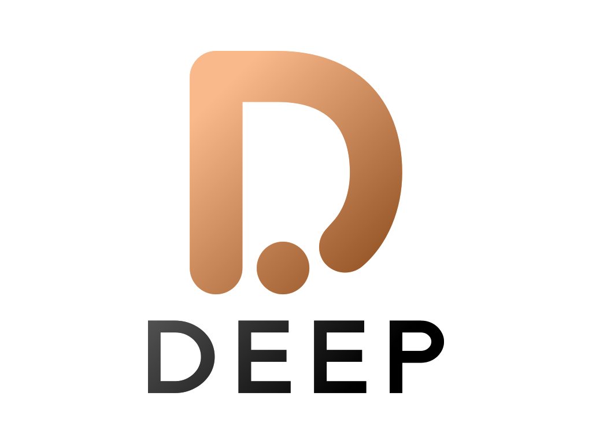

# Deep: Dynamic Application Instrumentation for Observability

Deep is a scalable, easy-to-operate, and cost-effective solution for the dynamic instrumentation of applications.
Designed with the Grafana Tempo / Prometheus codebase at its core, Deep aims to provide a seamless and efficient
approach to runtime application observability.

Deep introduces a powerful query language, DeepQL a monitoring-first query and command language inspired by PromQL, that
facilitates real-time addition and manipulation of logs, metrics, and traces, as well as the collection of data
snapshots from live runtime environments. This allows for more effective debugging, increased system visibility, and
enhanced performance monitoring.

Deep ingests data, buffers it and then writes it to Azure, GCS, S3 or local disk. As such it is robust, cheap and easy
to operate!

Inspired by Grafana Tempo and Prometheus, Deep enhances the observability ecosystem, while maintaining an approachable
learning curve and operational simplicity.

## Dynamic Instrumentation: A Fast and Efficient Approach

With Deep's dynamic instrumentation, the time-consuming cycles of code changes, staging, committing, pushing, PR
opening, building, testing, and deploying are eliminated. Deep allows you to control your observability at runtime,
without having to restart your application or navigate through lengthy deployment pipelines.

By shortening the turnaround time for changes to observability metrics, Deep significantly decreases the Mean Time to
Resolution (MTTR) during troubleshooting and debugging processes. This, in turn, can improve system reliability and
uptime, benefiting both developers and end users.

## Features

- Employs DeepQL to dynamically add logs, metrics, and traces to your applications. DeepQL provides the flexibility and
  ease of adjusting your observability parameters in real time.
- Allows for the collection of data snapshots from live runtime environments, providing an efficient way to capture
  system states for debugging or performance tuning.
- Leverages the existing labels for seamless integration and unified view across your metrics and logs, aligning with
  your current Grafana and Prometheus-based systems.
- Is supported in Grafana (requires Grafana v10 or above).

## Deep Application Instrumentation Stack

A Deep-based instrumentation stack consists of the following components:

1. **Deep Agent**: Responsible for dynamically instrumenting logs, metrics, traces and creating snapshots and sending
   them to the Deep Server.
2. **Deep Server**: Main server responsible for storing snapshots, defining tracepoints and processing DeepQL queries.
3. **Grafana**: Used for querying and displaying the logs, metrics, traces and snapshots.

## Philosophy

Deep, like Prometheus, champions a label-based approach to instrumentation. It seeks to provide an easy-to-operate
system with no dependencies but diverges from Prometheus by extending beyond metrics to a comprehensive observability
suite - including logs, metrics, and traces, as well as the dynamic addition of these components via DeepQL.

Deep strives to be a tool that is not only powerful in its capabilities, but also one that maintains simplicity in its
operations.

---

We hope that Deep contributes value to your application monitoring and troubleshooting efforts. We welcome your
contributions and feedback.

# Project Status

This project is currently in its early stages and as such we do not have all features working as we would like them to.
Here is a quick summary of the features and supported options:

 - Cloud support
   - :heavy_check_mark: AWS: Tested with EKS and S3
   - :warning: GCS: Support is available, but it is not tested
   - :warning: Azure: Support is available, but it is not tested
 - :x: Distributed Mode: This is not available yet - only single binary support is currently working
 - :warning: Multi Tenancy: Support is available, but it has not been tested
 - :x: DeepQL: Initial steps are complete, but it is not available yet.
 - Language Support:
   - :heavy_check_mark: [Java](https://github.com/intergral/deep-java-client) - The agent is available and released as version 1.0.0
   - :heavy_check_mark: [Python]https://github.com/intergral/deep-python-client - The Agent is available and released as version 1.0.0
   - Other languages (Ruby, Go, Node, .Net) are planned but not started.

If you have any suggestions, or preferences on languages then please let us know via Github Issues.

## Getting Started

- [Deployment Examples](./examples/README.md)
    - [Docker Compose](./examples/docker-compose/README.md)

## Acknowledgements

Deep is a fork of [Grafana Tempo](https://github.com/grafana/tempo), that has been reworked to work with the unique
aspects that Deep offers.

## License

Deep is distributed under [AGPL-3.0-only](LICENSE). For Apache-2.0 exceptions, see [LICENSING.md](LICENSING.md).
