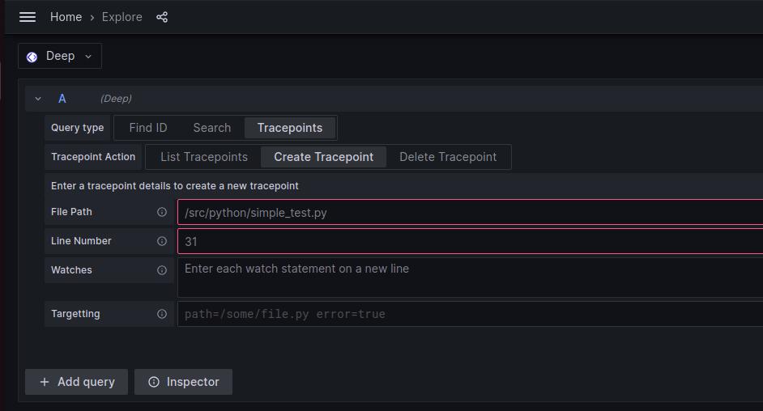
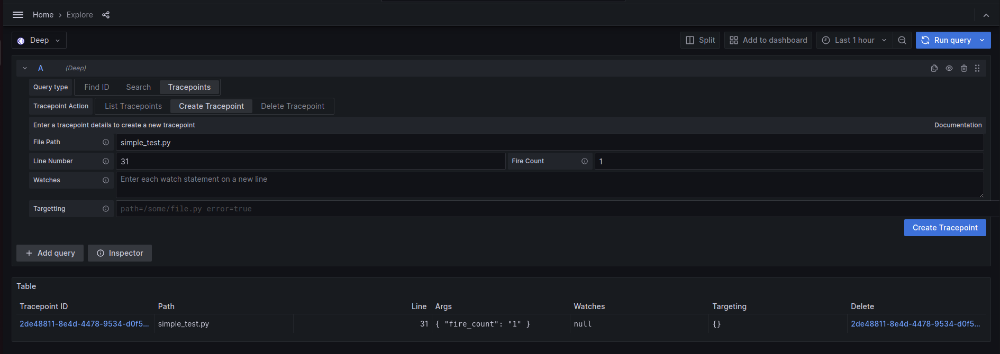
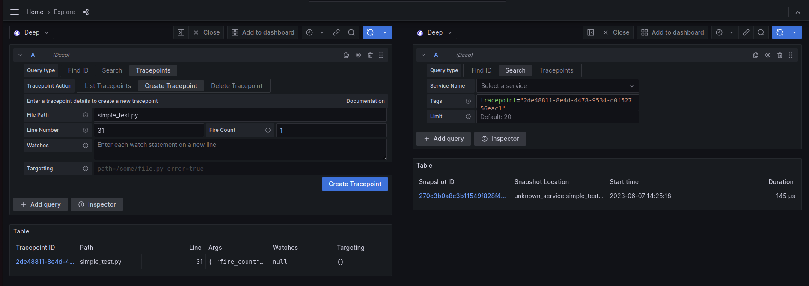
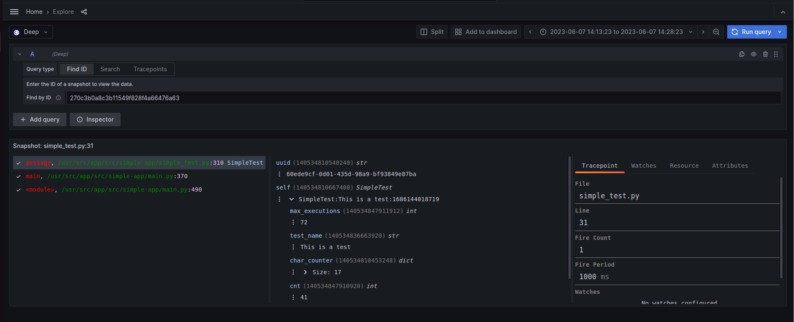

# Getting Started

On this page we will cover how to get started with DEEP using the local docker compose stack.

## Prerequisites

To follow this guide you will need to install:

- [Git](https://git-scm.com/book/en/v2/Getting-Started-Installing-Git)
- [Docker](https://docs.docker.com/engine/install/)
- [Docker Compose](https://docs.docker.com/compose/)

## Guide

To start deep using the local docker stack follow these steps:

1. Checkout the repo
   ```bash
   git checkout https://github.com/intergral/deep.git
   ```
2. Open the example directory
   ```bash
   cd examples/docker-compose/local
   ```
3. Start the services
   ```bash
   docker compose up -d
   ```

At this point docker will start the required containers. These will include:

- Deep - running in single tenant and single binary mode
- Prometheus - collecting metrics from deep
- Grafana - with datasource's connecting to Deep and Prometheus (this is currently a custom-built image with the deep
  plugins installed)
- Test App - A simple test app running python that can be used as the target to debug

## Using Deep

Now that we have deep running and a test app connected we want to see what we can do.

1. Open Grafana to the [explore page](http://localhost:3000/explore).
2. Ensure that the Deep data source is selected. (Should be the default datasource)
3. Now open the query input to create a tracepoint:



4. Here we can enter the file and line number to collect data. In this example we want to use:
    - File Path: simple_test.py
    - Line Number: 31

   Once set click 'Create Tracepoint' to create the tracepoint.
7. If created successfully you will see the result in the query result below:



8. This new config will be sent to the connected client and will result in a Snapshot being created. To see the
   Snapshots click on the lint in the column 'Tracepoint ID'. This will create a split view and show the available
   Snapshots.

   Note: It can take up to a minute before the Snapshot will be available in the results.



9. From this you can now select a snapshot from the list to view the full details.



Now you know how to create tracepoints and view the data you can play with creating other tracepoints, or changing the
settings to collect watches, or change the fire count. 

The source code for the test app is open source [intergral/python-deep-client/examples](https://github.com/intergral/deep-python-client/tree/master/examples) 


## Clean up
To clean up this example you simple need to remove the compose stack.

```bash
docker compose down -v
```

You will also might want to remove the stored data
```bash
rm -Rf deep-data
```
