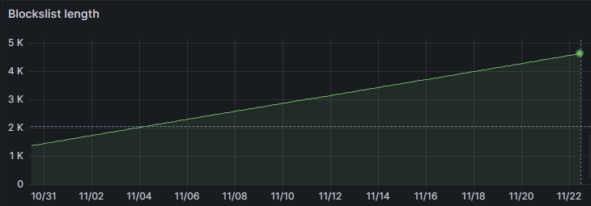

# Block Increase

## Meaning

This alert is indicating that the number of blocks has increased more than expected. This alert is trying to identify
the case where compaction or retention is not working correctly.

## Impact

If the number of blocks is increasing steadily for a long enough period this can impact the performance and cost of
Deep. As the number of blocks increase the time spent indexing and the cost of performing the indexing will increase.

## Diagnosis

Check the 'Deep/Tenants' dashboard for the number of blocks for the given tenant (tenant id should appear on the alert).
This graph should give you insight into the block growth.

A graph like this below indicates that the blocks are not getting deleted, the compactor logs should be inspected for
any errors.

If there is only a short spike in the blocks, this probably means there was a sudden large increase in usage. The blocks
should be monitored for further issues.

## Mitigation

If compaction/retention is nor working then the compactor should be restarted. This could resolve any issues within the
system memory, or if there are any failed tasks. Additionally check the permissions on the storage provider to ensure
Deep has permission to delete data.

It is also advisable to check the [compaction settings](../config/compaction.md) that are being used to ensure they best suite your use case.

{!_sections/bug_report.md!}
