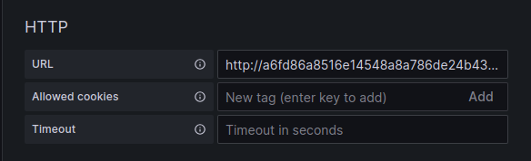

# AWS EKS

This example is for use with AWK EKS directly using a deployment file in place of helm.

In this example we are deploying as a single binary only, we are also not deploying grafana, or any test apps.

## Configure

Edit the [deployment.yml](./deployment.yml) file to add the AWS Access and Secret keys. For details about how to set up
the IAM role see our page in the docs [AWS Permissions](https://intergral.github.io/deep/deploy/aws/permissions/).

## Deploying

Configure kubectl to use the EKS cluster.

```bash
aws eks --region <AWS-Region> update-kubeconfig --name <Cluster-Name> --profile <AWS-CLI-Profile-Name>
```

Now deploy the pod to EKS.

```bash
kubectl apply -f deployment.yml
```

Note: As this is deploying to AWS there could be increased costs at AWS.

## Access

To access deep when running in this mode you need to get the address from eks.

```bash
kubectl get service --namespace deep
```

This will output the service config including the external ip.

```bash
NAME   TYPE           CLUSTER-IP       EXTERNAL-IP                                                              PORT(S)                          AGE
deep   LoadBalancer   10.100.176.146   a2c61b29dc8e24dc6928842d2b7f6dde-916825703.eu-west-1.elb.amazonaws.com   3300:31337/TCP,43315:31521/TCP   9s
```

You can now use the value in 'EXTERNAL-IP' for the service 'deep' to connect Grafana. Ensure you include the
protocol (http) and port (3300) `http://a6fd86a8516e14548a8a786de24b4332-1338461574.eu-west-1.elb.amazonaws.com:3300`.



To connect a client to the service, you need to use the 'EXTERNAL-IP' for the service 'deep'. Then set this to
the value of 'DEEP_SERVICE_URL' for the client. (see the [client docs](https://intergral.github.io/deep/#client) for more info)

## Clean up

To remove the example run:

```bash
kubectl delete namespace deep
```

Note: This will only clean up the EKS cluster you will have to delete the S3 data yourself.
